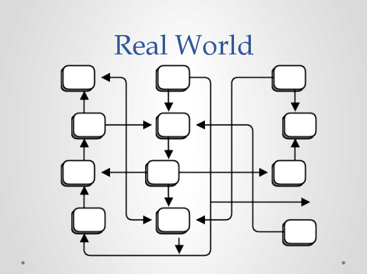
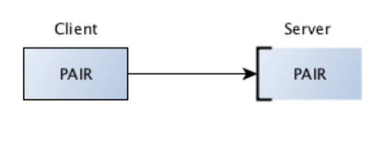
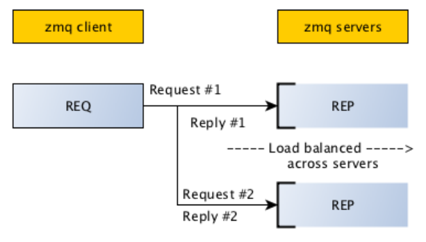
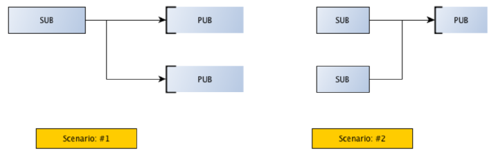
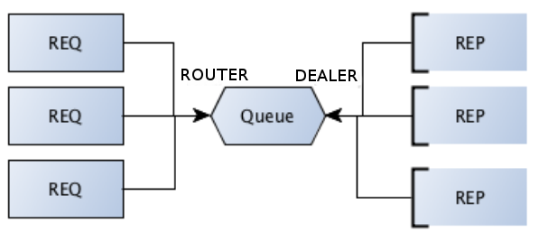
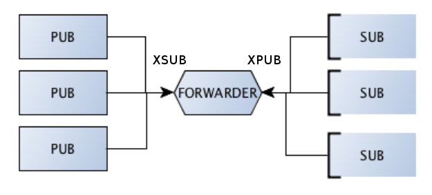
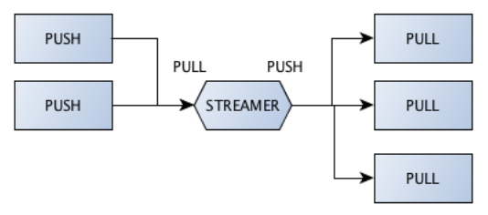

title: Introduction to ØMQ
author:
  name: Xin Gao
  twitter: xgao622
  url: http://about.me/xgao
output: index.html
theme: jdan/cleaver-retro

------------------------------------------------------------------------------

# Introduction to ØMQ
##[Xin Gao](http://twitter.com/@xgao622)
------------------------------------------------------------------------------

### Motivation

#### For [RobotX](https://github.com/idumpling/robotx) Distributed Way

How to make messaging work without a central server  
while not just use the low level Berkeley socket interface?

------------------------------------------------------------------------------

### What is ØMQ

It's not a message system;   
It is a messaging / communication library to be used programmatically.

------------------------------------------------------------------------------

### Zen of ØMQ

Zero

* Broker
* Latency (best effort)
* Administration
* Cost
* Waste 

------------------------------------------------------------------------------

### ØMQ Goal

# "To become part of the standard networking stack"

------------------------------------------------------------------------------

### ØMQ Goal

# "And then the Linux kernel"

------------------------------------------------------------------------------

### Fixing the Networking World

#### <center></center>

------------------------------------------------------------------------------

### ØMQ History

* 2004: iMatix created AMQP as a contractor for JP Morgan.
* 2005: iMatix published OpenAMQ.
* 2007: iMatix started the ØMQ project.
* 2010: iMatix left the AMQP standard committee.
* 2012: Two of original devs forked ØMQ as Crossroads I/O.
* 2013: Martin Sustrik started nanomsg.
* 2013: Pieter Hintjens announced a new draft of the ZMTP wire-level protocol.

------------------------------------------------------------------------------

### Why ØMQ

* Performance
    * Lower latency
    * Higher throughput
* Simplicity
* Scalability

------------------------------------------------------------------------------

### ØMQ Language Bindings

ØMQ comes with the low-level C API. High-level bindings exist in 40+ languages including:   

Probably the most impressive binding is PyZMQ:-)

Python, Perl, PHP, Ruby, Go, Erlang, Node.js, Java, Scala, Clojure, 
C/C++, Objective-C, C#, F#, Delphi, Basic, Haskell, Lua , Racket
CL, Felix, Q, Tcl, Ada, Haxe, ooc, ...

------------------------------------------------------------------------------

### ØMQ Install

On RHEL, Cent OS, Fedora

      $ yum install -y pkgconfig libtool gcc-c++ uuid
      $ wget http://download.zeromq.org/zeromq-4.0.4.tar.gz
      $ tar xvf zeromq-4.0.4.tar.gz
      $ cd zeromq-4.0.4/
      $ ./configure
      $ make
      $ make install
      $ echo /usr/local/lib > /etc/ld.so.conf.d/local.conf
      $ ldconfig

------------------------------------------------------------------------------

### ØMQ Language Bindings Install

* PyZMQ

      $ pip install pyzmq 

* GoZMQ:

      $ export PKG_CONFIG_PATH=/usr/local/lib/pkgconfig
      $ go get -tags zmq_4_x github.com/alecthomas/gozmq

* ...

------------------------------------------------------------------------------

### ØMQ Architecture

* ØMQ is running multiple worker threads that handle the asynchronous part of the communication: 
* various objects live in the worker threads.  
    * Do connection management.
    * Handle data transfer itself.
* the whole system has to become fully asynchronous. 
* No object can afford to do a blocking operation,   
* ØMQ uses a lock-free queue in pipe objects to pass messages between the user's threads and ØMQ's worker threads.

------------------------------------------------------------------------------

### Implementing a MSG Layer with ØMQ

Three-step approach:
  * Choosing a transport 
  * Setting up the infrastructure
  * Selecting a message pattern

------------------------------------------------------------------------------

### ØMQ Context

Before using any ØMQ library functions, the caller must initialize a ØMQ context:

```python
import zmq

context = zmq.Context()
```

Contexts are thread safe unlike sockets. 
An application can create and manage multiple contexts.

------------------------------------------------------------------------------

### ØMQ Sockets

ØMQ sockets are created from the initialized context:

```python
socket = context.socket(zmq.REP)
```

* ØMQ sockets are of certain types which enable one of the various communication patterns.
* ØMQ socket type must be passed during socket creation.

------------------------------------------------------------------------------

### ØMQ Sockets vs TCP Sockets

* ØMQ sockets carry messages, like UDP, rather than a stream of bytes as TCP does.   
* ØMQ sockets do their I/O in a background thread. 
* ØMQ sockets have one-to-N routing behavior built-in.

------------------------------------------------------------------------------

### ØMQ Messaging Patterns

<center>Pair Pattern </center>
<center></center>
<p></p>

------------------------------------------------------------------------------

### ØMQ Messaging Patterns

<center>Pair Pattern </center>
Paired sockets are very similar to regular sockets.
* The communication is bidirectional.
* There is no specific state stored within the socket.
* There can only be one connected peer.
* The server listens on a certain port and a client connects to it.

------------------------------------------------------------------------------

### ØMQ Messaging Patterns

<center>Request/Reply Pattern</center>
<center></center>
<p></p>

------------------------------------------------------------------------------

### ØMQ Messaging Patterns

<center>Request/Reply Pattern</center>
Most basic pattern is client/server model,  
where client sends a request and server replies to the request.

------------------------------------------------------------------------------

### ØMQ Messaging Patterns

<center>Pub/Sub Pattern</center>
<center></center>
<p></p>

------------------------------------------------------------------------------

### ØMQ Messaging Patterns

<center>Pub/Sub Pattern</center>
Publish/Subscribe is another classic pattern,  
where senders of messages, called publishers,   
do not program the messages to be sent directly to specific receivers, called subscribers.   
Messages are published without the knowledge of what or if any subscriber of that knowledge exists.

------------------------------------------------------------------------------

### ØMQ Messaging Patterns

<center>Pipeline Pattern</center>
<center></center>
<p></p>

------------------------------------------------------------------------------

### ØMQ Messaging Patterns

<center>Pipeline Pattern</center>
Push and Pull sockets let you distribute messages to multiple workers, arranged in a pipeline.   
A Push socket will distribute sent messages to its Pull clients evenly.   
Data always flows down the pipeline, and each stage of the pipeline is connected to at least one node.    
When a pipeline stage is connected to multiple nodes data is load-balanced among all connected nodes.   

------------------------------------------------------------------------------

### ØMQ Devices

<center>QUEUE</center>
<center></center>
<p></p>

------------------------------------------------------------------------------

### ØMQ Devices

<center>QUEUE</center>
A forwarder for the request/response messaging pattern.  
DEALER and ROUTER that let you do nonblocking request-response.   
Think of REQ and DEALER sockets as "clients"   
and REP and ROUTER sockets as "servers". 

------------------------------------------------------------------------------

### ØMQ Devices

<center>FORWARDER</center>
<center></center>
<p></p>

------------------------------------------------------------------------------

### ØMQ Devices

<center>FORWARDER</center>
A forwarder for the publish/subscribe messaging pattern.  
* We need XPUB and XSUB sockets because ØMQ does subscription forwarding from subscribers to publishers.   
* Just like QUEUE, which is like the request-reply broker,  
FORWARDER is like the pub-sub proxy server.    

------------------------------------------------------------------------------

### ØMQ Devices

<center>STREAMER</center>
<center></center>
<p></p>

------------------------------------------------------------------------------

### ØMQ Devices

<center>STREAMER</center>
A forwarder for the pipelined messaging pattern.  
* It is a device for parallelized pipeline messaging.   
* Acts as a broker that collects tasks from task feeders and supplies them to task workers.
<p></p>

------------------------------------------------------------------------------

### Transport Types

ØMQ provides 4 different transports:
* TCP: a network based transport    
tcp://hostname:port  
* IPC: an Inter-Process communication model    
ipc:///tmp/filename  
* INPROC: In-Process communication model  
inproc://name  
* MULTICAST: multicast via PGM, possibly encapsulated in UDP  
pgm://interface:address:port   
epgm://interface:address:port  

------------------------------------------------------------------------------

### Bind or Connect

As a general rule of thumb,   
* The node that does zmq_bind() is a "server", 
sitting on a well-known network address
* The node which does zmq_connect() is a "client", 
with unknown or arbitrary network addresses. 

------------------------------------------------------------------------------

### Examples

<center>Hello World</center>
[hwclient.py](http://zguide.zeromq.org/py:hwclient)

```python
import zmq

context = zmq.Context()

print("Connecting to hello world server...")
socket = context.socket(zmq.REQ)
socket.connect("tcp://localhost:5555")

for request in range(10):
    print("Sending request %s ..." % request)
    socket.send(b"Hello")

    message = socket.recv()
    print("Received reply %s [ %s ]" % (request, message))
```

------------------------------------------------------------------------------

### Examples

<center>Hello World</center>
[hwserver.py](https://github.com/imatix/zguide/blob/master/examples/Python/hwserver.py)

```python
import time
import zmq

context = zmq.Context()
socket = context.socket(zmq.REP)
socket.bind("tcp://*:5555")

while True:
    message = socket.recv()
    print("Received request: %s" % message)

    time.sleep(1)

    socket.send(b"World")
```

------------------------------------------------------------------------------

### Examples

<center>Divide and Conquer</center>
<center></center>
<p></p>

------------------------------------------------------------------------------

### Examples

<center>[RobotX](https://github.com/idumpling/robotx)</center>
<center></center>
<p></p>

------------------------------------------------------------------------------

### Projects

<center>[ØMQ Labs](http://zeromq.org/docs:labs)</center>

* [saltstack](http://www.saltstack.com/)
* [zerorpc](http://zerorpc.dotcloud.com/)
* [The Mongrel2 Web Server](http://mongrel2.org/)
* [Brubeck: Python web framework using 0MQ](http://brubeck.io/index.html)
* [Dotcloud with ZMQ](http://blog.dotcloud.com/tag/zeromq)
* OpenStack with ZMQ 
    * [Openstack Messaging with ZMQ](http://www.slideshare.net/yatinkumbhare/zmq-in-context-of-openstack-31975405)
    * [zeromq-rpc-plugin](http://ewindisch.github.io/nova/)
    * [ZeroMQ RPC for Ceilometer and Quantum](https://etherpad.openstack.org/p/havana-rpc-zmq-for-ceilometer-and-quantum)
    * ...

------------------------------------------------------------------------------

### Key Point

# ØMQ means there's NO MQ

------------------------------------------------------------------------------

### External links

* [ØMQ guide](http://zguide.zeromq.org/)
* [Advanced Network Architectures With ZeroMQ](http://pyvideo.org/video/442/pycon-2011--advanced-network-architectures-with-z)
* [ZeroMQ - The Architecture of Open Source Applications](http://www.aosabook.org/en/zeromq.html)

